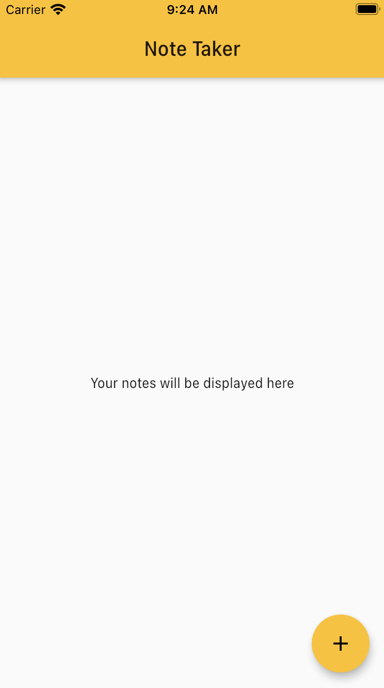
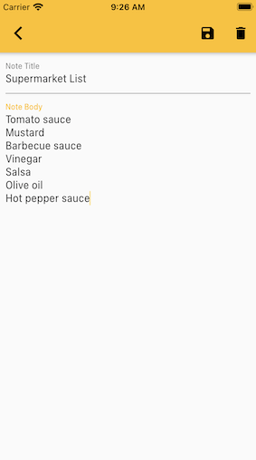
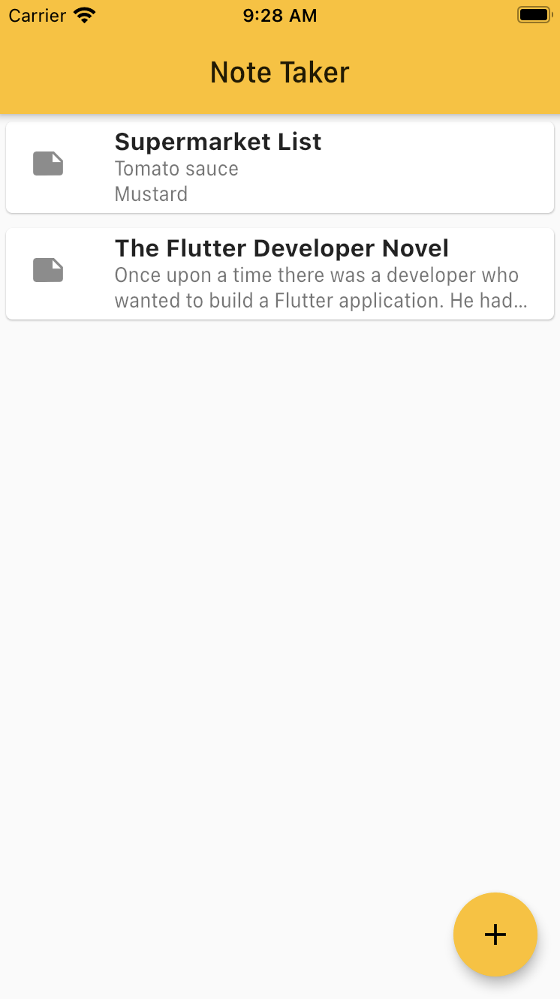

# Note Taker

An app to take notes. You can add, edit and delete your notes.

## The App

This is the home screen of the app. Here you will find all of the notes 
you create.
If you click on the button with the `+` you can add a note.

This is how it looks when you are adding a note. The buttons on the top are for saving and deleting notes. If the note hasn't been save going back to the home
screen or pressing the delete button will discard the changes.

Finaly, this is how your notes will be displayed in the home screen.

